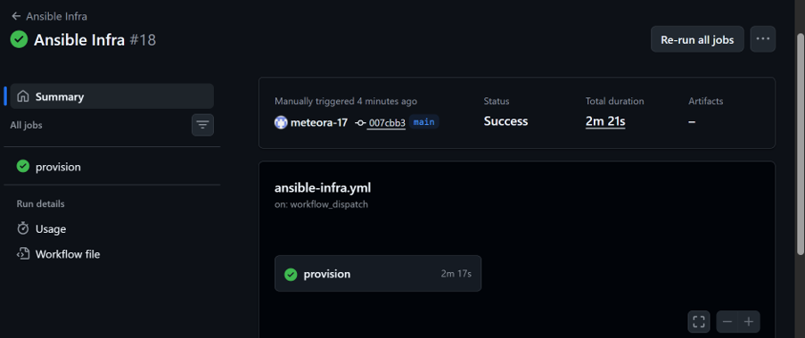
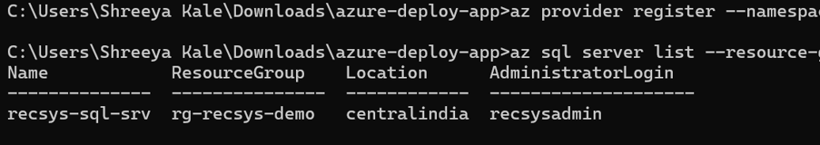

# Recommendation Scoring API

A Flask API deployed on Azure App Service, serving a category-affinity recommender
and the same Top-K ranking metrics (precision@k, recall@k, hit-rate@k) used in the
[Product Recommendation System](https://github.com/meteora-17/Dell-reccomender-system)
project — extended with a full infrastructure-as-code and CI/CD setup.

**Live:** http://shreeya-recsys-api.azurewebsites.net

## What this project demonstrates

- A working **Flask REST API**, deployed and running on **Azure App Service**
- **Infrastructure as code**: an **Ansible** playbook provisions Azure SQL Database
  and the App Service configuration declaratively, instead of manual `az` CLI steps
- **CI/CD**: the Ansible playbook runs automatically via **GitHub Actions** on every
  push, authenticated with a resource-group-scoped Azure service principal
  (least-privilege — the credential can only act within `rg-recsys-demo`, not the
  whole subscription)
- **Agile project tracking** via **Azure DevOps Boards** (Scrum: sprint planning,
  backlog management) for the infra work


*The Ansible Infra GitHub Actions workflow provisioning Azure SQL Database and App Service.*


*The resulting resource group in the Azure Portal.*

## Endpoints

- `GET /health` — service status check (reports whether it's running against Azure SQL or the in-memory fallback)
- `GET /products` — product catalog
- `GET /recommend/<user_id>` — category-affinity recommendations for a user
- `POST /metrics/score` — scores a recommendation list against ground-truth relevant items
  (`{"recommended": [1,2,3], "relevant": [2,3], "k": 3}`)

## Architecture

```
GitHub push → GitHub Actions
                 ├─ Test job:      pytest against the Flask app
                 └─ Provision job: az login (service principal)
                                   → ansible-playbook ansible/site.yml
                                       → az group create
                                       → az sql server / db create
                                       → az appservice plan / webapp create
                                       → az webapp config appsettings set
```

`app.py` defaults to an in-memory data layer (`USE_AZURE_SQL=false`) so local
development and the test suite need no database credentials. Setting
`USE_AZURE_SQL=true` with the `SQL_*` app settings (populated by the Ansible
playbook) switches it to query Azure SQL via `db.py`.

## Stack

Python, Flask, gunicorn, pymssql · Azure App Service (Linux, free tier) ·
Azure SQL Database (serverless, free tier) · Ansible (`ansible.builtin.command`
wrapping the Azure CLI) · GitHub Actions · Azure DevOps Boards

## Run locally

```bash
pip install -r requirements.txt
python app.py
```

## Test

```bash
pip install pytest
pytest test_app.py -v
```

## Infrastructure

The Ansible playbook is in [`ansible/site.yml`](ansible/site.yml), run via
[`.github/workflows/ansible-infra.yml`](.github/workflows/ansible-infra.yml).
It wraps idempotent `az` CLI calls rather than the `azure.azcollection` Python
SDK modules, avoiding that collection's Azure SDK version-compatibility issues
while still giving a version-controlled, automatically-executed, repeatable
provisioning process.

Database schema and seed data: [`schema.sql`](schema.sql).
